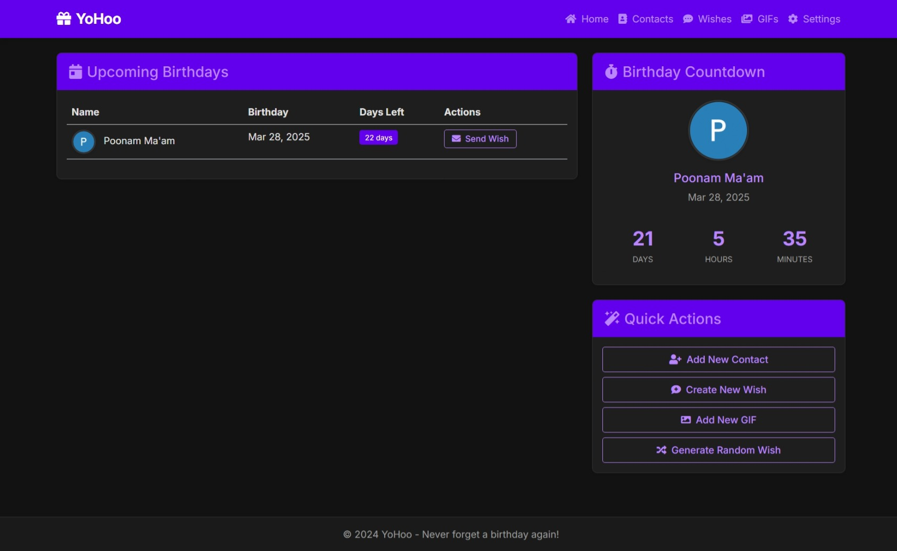
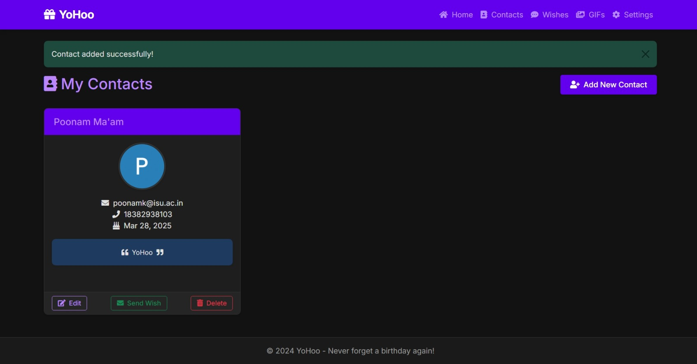
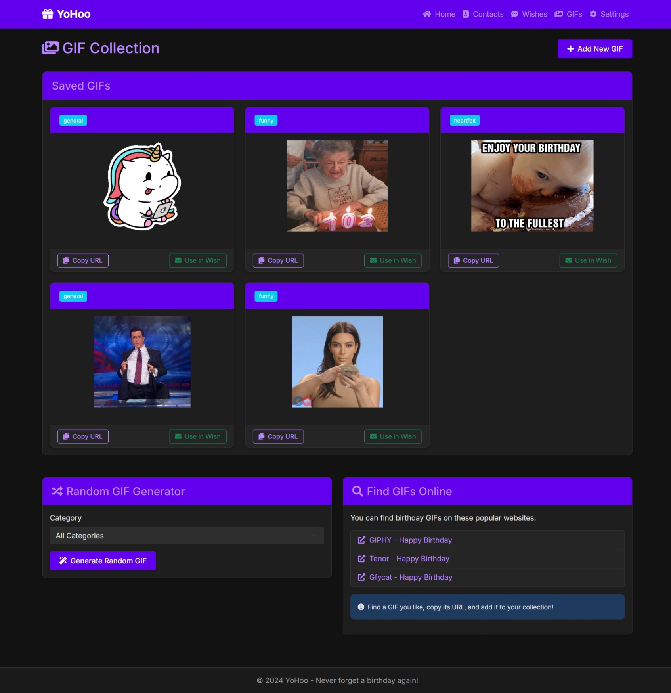
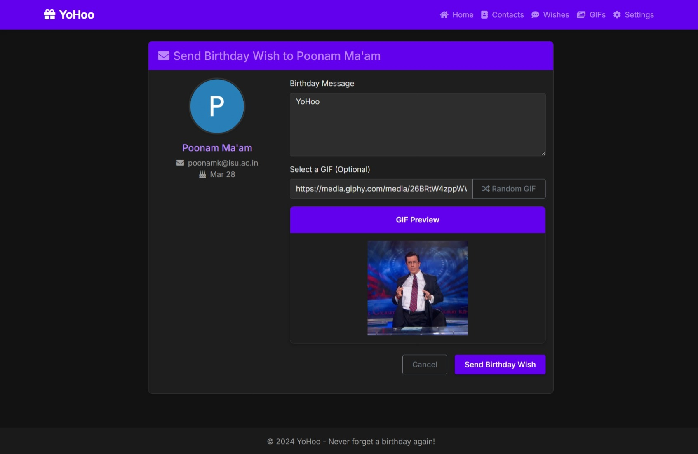
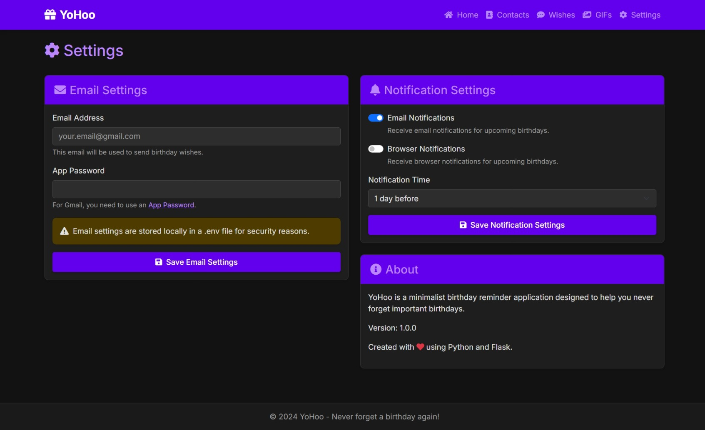
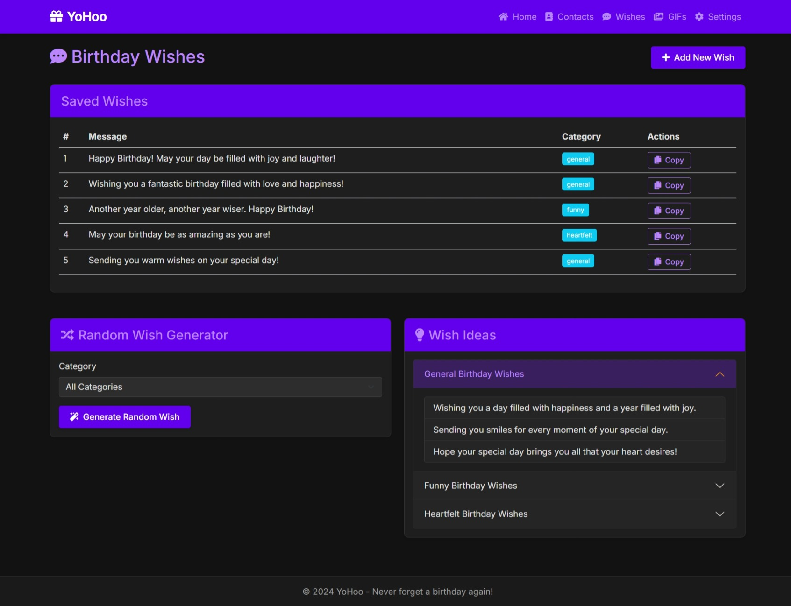

# 📌 YoHoo - Birthday Reminder & Wishes App

A minimalist, elegant birthday reminder application that helps you remember and celebrate birthdays with personalized messages and GIFs. Never forget a birthday again with this sleek, dark-themed application.

## 🔥 Unique Features

- 🎂 Automated birthday emails/messages to contacts
- 🎁 Custom messages and GIFs for each contact
- 📅 Smart birthday storage and upcoming reminders
- 🖼️ Contact management with profile pictures
- ⏱️ Real-time countdown timer for upcoming birthdays
- 💌 Random birthday wish generator with categories
- 👀 GIF preview before sending wishes
- 🌙 Elegant dark theme with purple accents

## 🎨 Screenshots



<details>
<summary>Click to see more screenshots</summary>







</details>

## 🛠 Technologies/Libraries Used

- **Backend**: Python, Flask, SQLAlchemy
- **Frontend**: HTML5, CSS3, JavaScript, Bootstrap 5
- **Database**: SQLite
- **Email**: SMTP, MIMEText, MIMEMultipart
- **UI Components**: Font Awesome, Inter font
- **API Integration**: External GIF services
- **Security**: Environment variables, dotenv

## 🚀 How to Run the Project

1. Clone the repository
   ```
   git clone https://github.com/AnshumanAtrey/YoHoo.git
   ```

2. Install dependencies
   ```
   pip install -r requirements.txt
   ```

3. Set up environment variables
   - Copy `.env.example` to `.env`
   - Update the values in the `.env` file:
     ```
     SECRET_KEY=your_secure_random_key_here
     EMAIL_USER=your_email@gmail.com
     EMAIL_PASSWORD=your_app_password_here
     ENABLE_EMAIL_NOTIFICATIONS=True
     NOTIFICATION_DAYS=1
     ```

4. Run the application
   ```
   python app.py
   ```

5. Open your browser and navigate to
   ```
   http://localhost:5000
   ```

## 🚀 Deployment

This application can be deployed on Netlify connected with GitHub:

1. Push the code to a GitHub repository
2. Connect the repository to Netlify
3. Set up build settings and environment variables:
   - Build command: `pip install -r requirements.txt && python app.py`
   - Publish directory: `.`
   - Environment variables: Same as in the `.env` file

## 🤖 Extra Features

- **Input Validation**: Email validation, required fields checking
- **Responsive Design**: Works on mobile, tablet, and desktop
- **Accessibility**: Proper contrast ratios, semantic HTML
- **Notification System**: Email and browser notifications
- **Custom Message Templates**: Save and reuse birthday wishes
- **GIF Management**: Save and categorize GIFs for reuse
- **Data Security**: Secure password storage, environment variables
- **Modern UI**: Minimalist aesthetic with clean layouts
- **Animations**: Subtle fade-in animations for a polished feel
- **Custom Scrollbars**: Enhanced scrollbar styling
- **Error Handling**: User-friendly error messages
- **Flexible Categories**: Organize wishes and GIFs by categories

## 📝 License

MIT License

## 🙏 Acknowledgements

- Font Awesome for icons
- Google Fonts for the Inter font
- Bootstrap team for the framework 